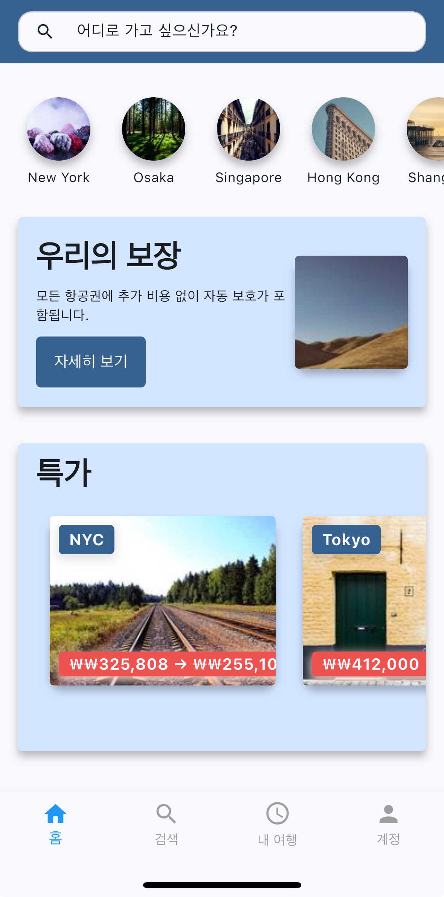
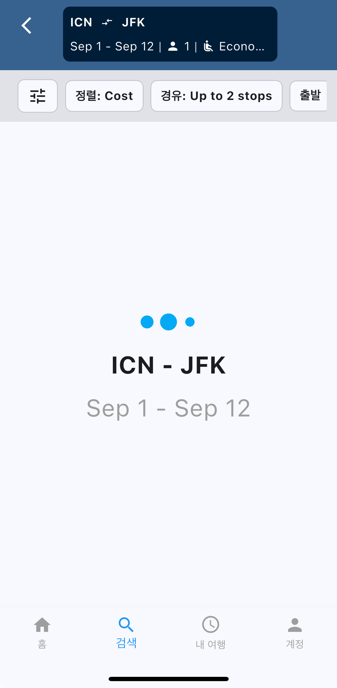
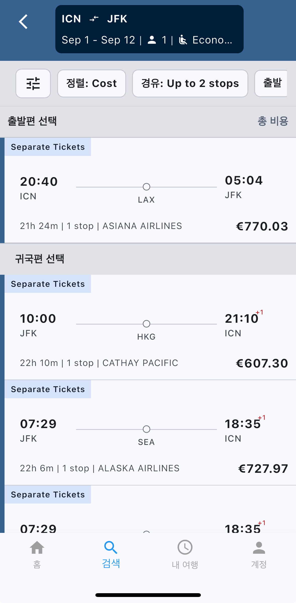
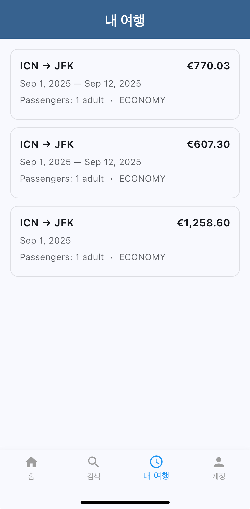
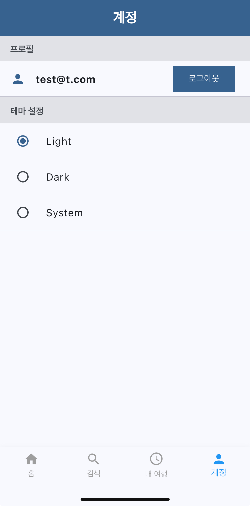

# TFA — Skiplagged 스타일 항공 검색/예약 앱 (Flutter + FastAPI)

Anywhere 목적지 탐색, 왕복/편도 검색, 필터/정렬, 리턴편 슬라이드 인 UX를 제공하며
Amadeus API로 실제 항공편 검색과 예약(Booking)을 수행합니다.
클라이언트는 Flutter + Riverpod, 서버는 FastAPI 기반입니다. Firebase Auth 로그인 구현됨.

---
## APK
- tfa.zip - android apk
  
## 기능

- Anywhere 목적지 탐색: 리스트 ↔ 지도 토글
- 항공편 검색/예약: Amadeus API 기반 운임/구간 조회 및 Booking 플로우
- 필터/정렬: 가격, 소요시간, 가성비, 경유 수, 항공사, 출·도착 시간
- 왕복 UX: 출발편 선택 시 리턴편 리스트가 아래에서 슬라이드 인
- 검색 파라미터 일괄 업데이트: updateSearch() + searchNonce 로 재검색 트리거
- 국제화(l10n), 라이트/다크 테마(기본 라이트)

## 📸 스크린샷

<p align="center">
  
  
  
  <br/>
  
  
  
</p>

---

## 기술 스택

- Flutter (Dart), Riverpod, Intl(l10n)
- Firebase Auth (이메일/구글 로그인)
- FastAPI + SQLAlchemy
- Amadeus API 연동(서버 측 호출)

---

## 폴더 구조

```text
TFA/
├─ android/
├─ ios/
├─ assets/
├─ build/
├─ lib/
│  ├─ constants/              앱 전역 상수(색상, 패딩, 키 등)
│  ├─ l10n/                   ARB 및 생성된 로컬라이즈 파일
│  ├─ misc/                   작은 헬퍼/임시 유틸(정리 대상 모음)
│  ├─ models/                 데이터 모델(Freezed/JsonSerializable 등)
│  ├─ providers/              Riverpod Providers, StateNotifier/State
│  ├─ screens/                페이지 단위 UI(검색/리스트/디테일 등)
│  ├─ services/               API/Repository(Amadeus/Flight/Firebase)
│  ├─ theme/                  ThemeData, ColorScheme, 타이포그래피
│  ├─ types/                  typedef 및 공용 타입
│  ├─ utils/                  날짜/통화 포맷, api_config 등 공용 유틸
│  ├─ widgets/                재사용 UI 컴포넌트(카드, 로딩, 타일 등)
│  ├─ firebase_options.dart   FlutterFire 자동 생성 설정
│  └─ main.dart               진입점(MaterialApp, ProviderScope)
├─ web/
├─ .vscode/
├─ .dart_tool/
├─ .flutter-plugins-dependencies
├─ .gitignore
├─ .metadata
├─ firebase.json
├─ analysis_options.yaml
├─ devtools_options.yaml
├─ i10n.yaml                  로컬라이제이션 설정(프로젝트 설정 파일명 기준)
├─ pubspec.yaml
├─ pubspec.lock
└─ README.md
```

# TFA — Skiplagged-style Flight Search & Booking (Flutter + FastAPI)

Provides “Anywhere” exploration, one-way/round-trip search, filters/sorting, and a slide-in return-list UX.
Uses the Amadeus API for real flight search and booking.
Client is Flutter + Riverpod; server is FastAPI. Firebase Auth login is implemented.

---

## Features

- Anywhere exploration: list ↔ map toggle
- Real flight search and booking: Amadeus-based pricing/segments and booking flow
- Filters/sorting: price, duration, value score, number of stops, airlines, departure/arrival windows
- Round-trip UX: when a departure is picked, the return list slides in from the bottom
- Single point of truth for search params: updateSearch() + searchNonce to trigger refreshes
- i18n/l10n and light/dark themes (default: light)

---

## Tech Stack

- Flutter (Dart), Riverpod, Intl (l10n)
- Firebase Auth (email/Google)
- FastAPI + SQLAlchemy
- Amadeus API (server-side integration)

---

## Folder Structure
```text
TFA/
├─ android/
├─ ios/
├─ assets/
├─ build/
├─ lib/
│  ├─ constants/              App-wide constants (colors, paddings, keys)
│  ├─ l10n/                   ARB and generated localization files
│  ├─ misc/                   Small helpers/misc utilities
│  ├─ models/                 Data models (e.g., Freezed/JsonSerializable)
│  ├─ providers/              Riverpod providers, StateNotifiers/States
│  ├─ screens/                Page-level UI (search/list/detail, etc.)
│  ├─ services/               API/Repository layer (Amadeus/Flight/Firebase)
│  ├─ theme/                  ThemeData, ColorScheme, typography
│  ├─ types/                  Typedefs and shared types
│  ├─ utils/                  Common utils (date/currency formatting, api config)
│  ├─ widgets/                Reusable UI components (cards, loading, tiles)
│  ├─ firebase_options.dart   FlutterFire auto-generated settings
│  └─ main.dart               Entry point (MaterialApp, ProviderScope)
├─ web/
├─ .vscode/
├─ .dart_tool/
├─ .flutter-plugins-dependencies
├─ .gitignore
├─ .metadata
├─ firebase.json
├─ analysis_options.yaml
├─ devtools_options.yaml
├─ i10n.yaml                  Localization config (project setting)
├─ pubspec.yaml
├─ pubspec.lock
└─ README.md
```
---

## Quick Start

Requirements
- Flutter SDK (stable)
- Xcode/iOS and Android SDKs
- Backend API endpoint (e.g., https://tfaserver-production.up.railway.app)
- Amadeus credentials configured on the FastAPI server

Install and run

flutter clean
flutter pub get

# Run on an iOS or Android device/emulator
flutter run -d ios
# or
flutter run -d android

---

## Environment Variables

Client (Flutter)
The app reads the server base URL via String.fromEnvironment('API_URL').

Name     | Example                                     | Description
---------|---------------------------------------------|------------
API_URL  | https://tfaserver-production.up.railway.app | FastAPI base URL

Inject at build time (iOS IPA example):

flutter build ipa --release \
  --export-method app-store \
  --dart-define=API_URL=https://tfaserver-production.up.railway.app

Server (FastAPI) example
- AMADEUS_CLIENT_ID
- AMADEUS_CLIENT_SECRET

---

## Firebase (Login)

- iOS: ios/Runner/GoogleService-Info.plist
- Android: android/app/google-services.json
- For Google Sign-In/OAuth, register bundle ID, SHA keys, and redirect URIs in Firebase Console

---

## Deployment

iOS (TestFlight)

1. Bump version/build in Xcode
2. Product > Archive
3. Organizer → Distribute App → App Store Connect → Upload
   Or build an IPA with Flutter and upload via Transporter:

   flutter build ipa --release \
     --export-method app-store \
     --dart-define=API_URL=https://tfaserver-production.up.railway.app

4. In App Store Connect → TestFlight, wait for Processing, then add internal/external testers

Notes: Prefer HTTPS (no ATS exceptions). Bundle ID must match the App Store Connect app.

Android

flutter build appbundle --release \
  --dart-define=API_URL=https://tfaserver-production.up.railway.app

Set up signing and upload to Play Console.

---

## Dev Notes

- No-op updates: identical search parameters are ignored to prevent redundant searches
- Force refresh: updateSearch(bumpNonce: true) to increment searchNonce and re-query
- When a departure is selected, render it once at the top and exclude it from the list below
- Remove top list inset if needed with MediaQuery.removePadding(removeTop: true)

---

## Roadmap (example)

- Price history/graphs
- Hidden-city detection/surfacing
- Self-transfer routing optimization
- Hotels/rental cars: start with UI, then wire real APIs

---
